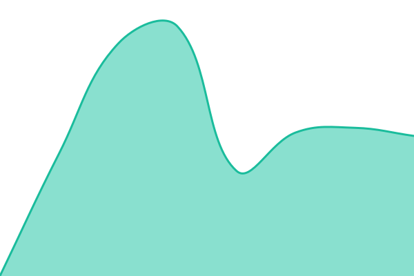
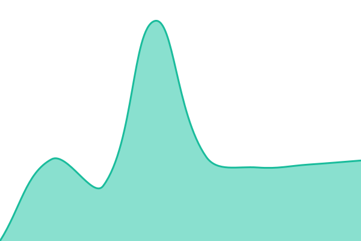

# [📈 Live Status](https://Keshiwei.github.io/web_check): <!--live status--> **🟩 All systems operational**

This repository contains the open-source uptime monitor and status page for [Keshiwei](https://Keshiwei.github.io/web_check), powered by [Upptime](https://github.com/upptime/upptime).

With [Upptime](https://upptime.js.org), you can get your own unlimited and free uptime monitor and status page, powered entirely by a GitHub repository. We use [Issues](https://github.com/Keshiwei/web_check/issues) as incident reports, [Actions](https://github.com/Keshiwei/web_check/actions) as uptime monitors, and [Pages](https://Keshiwei.github.io/web_check) for the status page.

<!--start: status pages-->
<!-- This summary is generated by Upptime (https://github.com/upptime/upptime) -->
<!-- Do not edit this manually, your changes will be overwritten -->
<!-- prettier-ignore -->
| URL | Status | History | Response Time | Uptime |
| --- | ------ | ------- | ------------- | ------ |
|  [广菲](https://www.fairland.com.cn/) | 🟩 Up | [广菲.yml](https://github.com/Keshiwei/web_check/commits/HEAD/history/广菲.yml) | 

 827ms
     
 | 

<a href="https://Keshiwei.github.io/web_check/history/广菲">100.00%</a>
    

|  [夸克](https://www.aquark.com/) | 🟩 Up | [夸克.yml](https://github.com/Keshiwei/web_check/commits/HEAD/history/夸克.yml) | 

 4271ms
     
 | 

<a href="https://Keshiwei.github.io/web_check/history/夸克">100.00%</a>
    

|  [安捷](https://www.aquagem.com/) | 🟩 Up | [安捷.yml](https://github.com/Keshiwei/web_check/commits/HEAD/history/安捷.yml) | 

 1051ms
     
 | 

<a href="https://Keshiwei.github.io/web_check/history/安捷">100.00%</a>
    

|  [Group](https://www.fairlandgroup.com/) | 🟩 Up | [group.yml](https://github.com/Keshiwei/web_check/commits/HEAD/history/group.yml) | 

 1020ms
     
 | 

<a href="https://Keshiwei.github.io/web_check/history/group">100.00%</a>
    

|  [内销](https://www.fairlandgroup.com.cn/) | 🟩 Up | [内销.yml](https://github.com/Keshiwei/web_check/commits/HEAD/history/内销.yml) | 

 1200ms
     
 | 

<a href="https://Keshiwei.github.io/web_check/history/内销">100.00%</a>
    

|  [法分](https://igardenfrance.fr/) | 🟩 Up | [法分.yml](https://github.com/Keshiwei/web_check/commits/HEAD/history/法分.yml) | 

 1077ms
     
 | 

<a href="https://Keshiwei.github.io/web_check/history/法分">94.72%</a>
    

|  [iGarden](https://www.igarden.ai/) | 🟩 Up | [i-garden.yml](https://github.com/Keshiwei/web_check/commits/HEAD/history/i-garden.yml) | 

 881ms
     
 | 

<a href="https://Keshiwei.github.io/web_check/history/i-garden">100.00%</a>
    

<!--end: status pages-->

[**Visit our status website →**](https://Keshiwei.github.io/web_check)

## 📄 License

- Powered by: [Upptime](https://github.com/upptime/upptime)
- Code: [MIT](./LICENSE) © [Anand Chowdhary](https://anandchowdhary.com)
- Data in the `./history` directory: [Open Database License](https://opendatacommons.org/licenses/odbl/1-0/)
